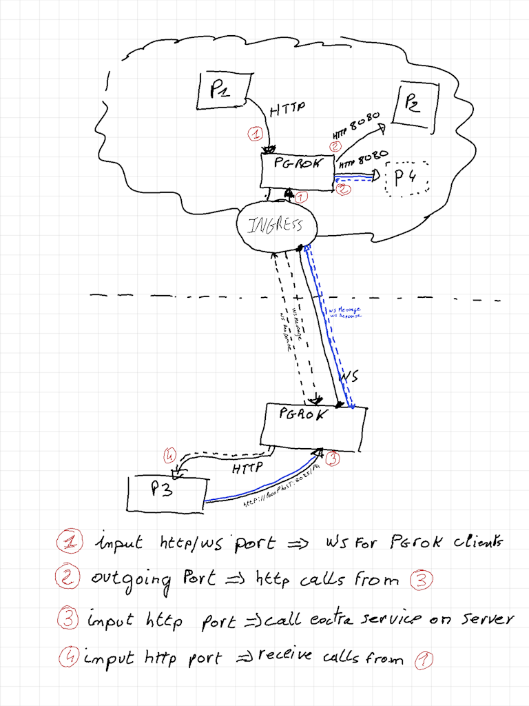
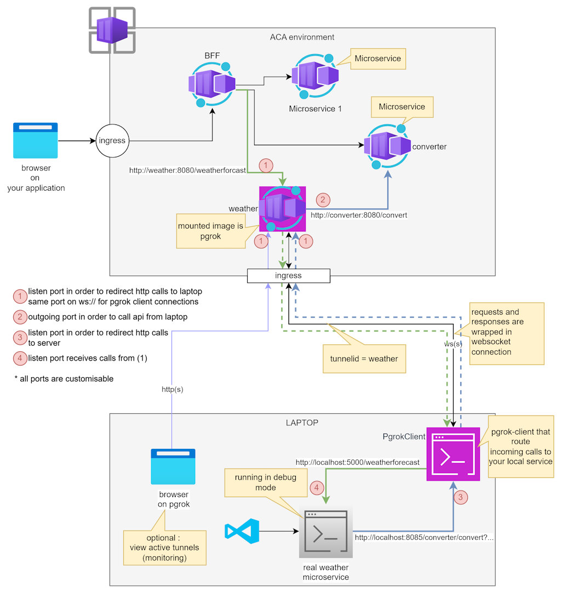

# Pgrok

[](https://github.com/pgourlain/vscode_erlang/blob/master/LICENSE)


This project can help you debug a service hosted in an ACA (Azure Container Apps) environment.
The concept is to install a wrapper in the environment that redirects calls to your local machine (allowing you to debug the service locally)

# Global architecture

The idea was :



### HTTP scenario :



### TCP scenario :

coming soon


# Installation

There are 2 parts to install : One server and one client at minimum

## Server installation

There are 2 running modes

1) one instance that "wrap"" multiple services : one per tunnelId. This mode allow to use one server with multiple clients.
2) one instance that "wrap" one service : this mode is usefull in replacement of your service to debug. This mode allow to use one server with one client only. 

For both modes, there is only one docker image => ghcr.io/pgourlain/pgrok:latest 
1) deploy ghcr.io/pgourlain/pgrok:latest into your aca environment
2) allow ingress with target port 8080

available switches with environment variables : 
- PGROK_PORT
    - port to listen, default is 8080
- PGROK_LOCALHOST
    - list on localhost only, used in debug mode
- PGROK_SINGLE_TUNNEL
    - activate single tunnel mode on http. It means that only one client will be accepted
- PGROK_TCPPORT
    - port to listen for tcp, switch to tcp mode if specified   
- PGROK_PROXYPORT
    - port to use to call other local services on server side, default is 8080    

## Server installation using executable only

client dotnet tool can be setup to run as server

```shell
dotnet tool install --global pgrok-client
# example 
pgrok start-server --localhost --proxyPort=5067 
```

## Check server installation

after deploying server, open in browser url of ingress (example https://pgrok--xxxx.xxxxxx.westeurope.azurecontainerapps.io/$status)

if launch on localhost : browse http://localhost:8080/$status


## Client installation

```shell
dotnet tool install --global pgrok-client
```

## Start client

```shell
pgrok start --tunnelId svc1 --localAddress http://localhost:5066 --serverAddress https://pgrok.xxxxx.westeurope.azurecontainerapps.io/
```


# Known limitations

on server side :
- /$status is a reserved url for monitoring and cannot be change yet